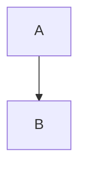

# Markdown Renderer

A client-side Markdown editor with live preview, syntax highlighting, and diagram support. No server required — works entirely in the browser.

## Features

- **Live Preview** — See rendered output as you type
- **GitHub Flavored Markdown** — Tables, task lists, strikethrough, and more
- **Syntax Highlighting** — Code blocks with language-specific highlighting via highlight.js
- **Mermaid Diagrams** — Flowcharts, sequence diagrams, class diagrams, and Gantt charts
- **Dark Mode** — Toggle between light and dark themes (persisted in localStorage)
- **Responsive Layout** — Side-by-side on desktop, stacked on mobile
- **Resizable Panels** — Drag the divider to adjust editor/preview split

## Usage

Open `index.html` in a browser. No build step or server needed.

### Supported Markdown

```markdown
# Headings
**bold** and *italic*
~~strikethrough~~
[links](https://example.com)


- Lists
- [x] Task lists

| Tables | Work |
|--------|------|
| Too    | Yes  |

> Blockquotes

\`inline code\` and fenced code blocks:

```javascript
const hello = "world";



## Tech Stack

- [marked.js](https://marked.js.org/) — Markdown parsing
- [highlight.js](https://highlightjs.org/) — Syntax highlighting
- [Mermaid](https://mermaid.js.org/) — Diagram rendering

All libraries loaded via CDN — no npm install required.
