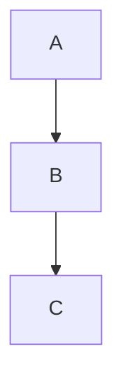

# Markdown Renderer

A free, client-side Markdown editor with live preview. No sign-up, no server, no build step — runs entirely in the browser.

🔗 **Live Demo:** [jimit105.github.io/markdown-renderer](https://jimit105.github.io/markdown-renderer/)

## Features

- **Live Preview** — Rendered output updates as you type (< 100ms)
- **GitHub Flavored Markdown** — Tables, task lists, strikethrough
- **Syntax Highlighting** — Language-specific code highlighting (JS, Python, HTML, CSS, TypeScript, JSON, and more)
- **Mermaid Diagrams** — Flowcharts, sequence diagrams, class diagrams, Gantt charts
- **Dark Mode** — Toggle between light/dark themes, respects system preference, persisted in localStorage
- **Shareable Links** — Compress editor content into a URL and share it (lz-string compression in the hash)
- **Responsive Layout** — Side-by-side on desktop, stacked on mobile (768px breakpoint)
- **Resizable Panels** — Drag the divider to adjust editor/preview split (mouse + touch)
- **SEO Optimized** — Open Graph, Twitter Cards, JSON-LD structured data
- **Google Analytics** — Ready to plug in your Measurement ID

## Usage

Open `index.html` in a browser. That's it.

To share your markdown, click the 🔗 button — it compresses the content into the URL and copies it to your clipboard. Anyone with the link sees the same content.

### Supported Syntax

````markdown
# Headings
**bold**, *italic*, ~~strikethrough~~
[links](https://example.com) and 

- Unordered lists
1. Ordered lists
- [x] Task lists

| Tables | Work |
|--------|------|
| Yes    | They do |

> Blockquotes

`inline code` and fenced code blocks:

```javascript
const hello = "world";
```


````

## Tech Stack

| Library | Purpose | CDN |
|---------|---------|-----|
| [marked.js](https://marked.js.org/) v12 | Markdown parsing | cdnjs |
| [highlight.js](https://highlightjs.org/) v11.9 | Syntax highlighting | cdnjs |
| [Mermaid](https://mermaid.js.org/) v10.9 | Diagram rendering | cdnjs |
| [lz-string](https://pieroxy.net/blog/pages/lz-string/) v1.5 | URL compression for sharing | cdnjs |

No npm install, no build step. Three files (`index.html`, `style.css`, `app.js`) plus CDN references.
