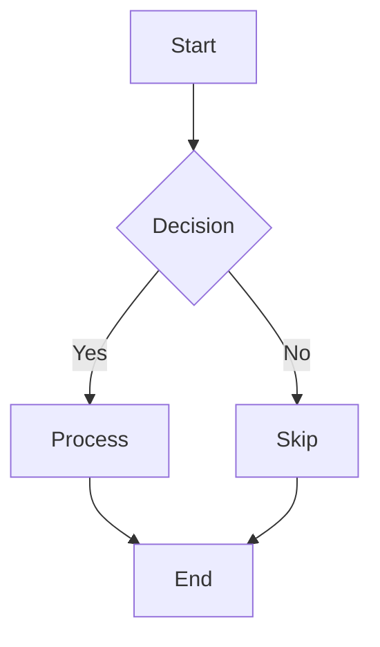

# Sample Markdown Document

## Overview

This document demonstrates various markdown features including diagrams, tables, code snippets, and task lists.

## Mermaid Diagram



## Task List

- [x] Complete initial setup
- [x] Write documentation
- [ ] Review code
- [ ] Deploy to production
- [ ] Monitor metrics

## Code Snippet

```python
def calculate_fibonacci(n):
    if n <= 1:
        return n
    return calculate_fibonacci(n-1) + calculate_fibonacci(n-2)

# Example usage
result = calculate_fibonacci(10)
print(f"Fibonacci(10) = {result}")
```

## Data Table

| Feature | Status | Priority | Owner |
|---------|--------|----------|-------|
| Authentication | Complete | High | Alice |
| API Gateway | In Progress | High | Bob |
| Database | Complete | Medium | Carol |
| Monitoring | Pending | Low | Dave |

## Additional Elements

### Inline Code

Use `npm install` to install dependencies and `npm start` to run the application.

### Blockquote

> "The best way to predict the future is to invent it."
> — Alan Kay

### Nested List

1. Backend Development
   - API design
   - Database schema
   - Authentication
2. Frontend Development
   - UI components
   - State management
   - Routing
3. DevOps
   - CI/CD pipeline
   - Infrastructure as code
   - Monitoring setup
   